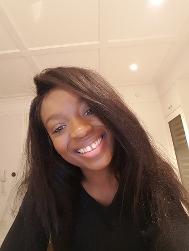

# About Me!

## Hello technologists and other curious individuals, welcome to my page! 

I'm a data scientist and social entrepreneur, with an MSc in Data Analytics from Fordham University, and I'm in love with the process of finding meaningful insights from data in order to generate profitable business impact and social impact. 

We all have our hobbies, and so like pinky and the brain, in my free time I love to plot ways to take over the world...mwuahahaha! 

# Articles
I haven't been consistent as I would like with my data driven articles but you can indulge in the ones I have already published on [Medium](https://medium.com/@Emi.N.Harry/).

Be sure to clap and follow me so you can be kept in the loop.

# Past Projects

[Assessment Of Minorities Access to Finance](https://enharry.github.io/Access-to-Finance/)

[Consumer IOS App Watching Analysis](https://enharry.github.io/watchtower/)

[R Shiny App  Simple BMI Calculator](https://enharry.shinyapps.io/BMI-app/)

[R Shiny App Breast Tumor Predictor](https://enharry.shinyapps.io/CancerPredictor/)

[R Shiny App N-gram Next Word Predictor](https://enharry.shinyapps.io/WordPrediction/)

# Technical Reports on some past projects
[SwiftKey Sentiment Analysis](https://rpubs.com/ENHarry/Milestone)

[Breast Cancer Classification](https://rpubs.com/ENHarry/BCancer)

[Air Pollution Analysis](https://rpubs.com/ENHarry/airpollution)

[Body Activity Analysis -Jawbone](https://rpubs.com/ENHarry/jawboneanalysis) 

# Current & Future Projects

Like Pinky and The Brain, I am always working on something new, but unlike them mine actually works....lol.. so stay tuned for more project updates.

### P.S. I am interested in projects that are machine learning/AI driven, and eager to try out experiments using deep and reinforcment learning. Feel free to [contact me](emi.nonye@gmail.com) if you have a project within my scope of interests or if you merely want to pick  my brain for some useful insights on whatever you may be working on. 
